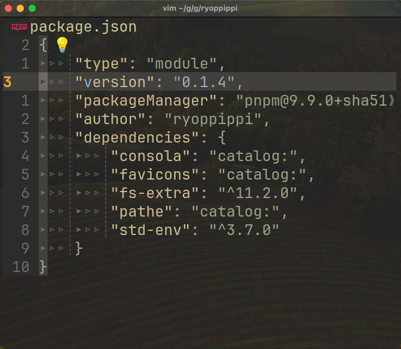
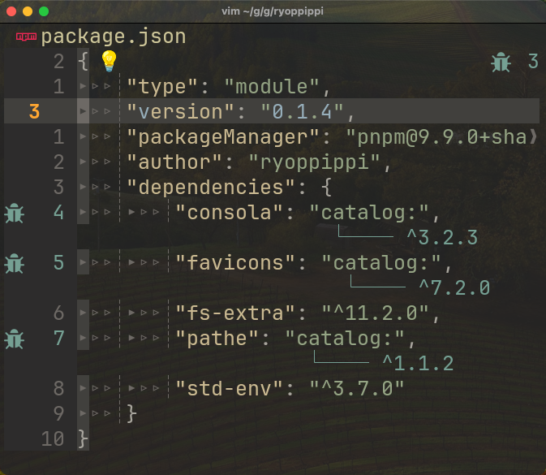

<p align="center">
  
</p>

<h1 align="center">PNPM Catalog Lens <sup>Neovim</sup></h1>

<p align="center">
  Show versions as diagnostics for <a href="https://pnpm.io/catalogs" target="_blank">PNPM <code>catalog:</code> field.</a><br>
</p>

<p align="center" display="flex">
    
    
</p>

## Install

Using lazy.nvim:

```lua
---@type LazySpec
return {
  'https://github.com/ryoppippi/nvim-pnpm-catalog-lens',
  ft = { 'json' },
}
```

## Commands

| Command                  | Description      |
| ------------------------ | ---------------- |
| `PnpmCatalogLensEnable`  | Enable the lens  |
| `PnpmCatalogLensDisable` | Disable the lens |

## Configuration

You can configure the display option for the detected version using the global variable `g:pnpm_catalog_display`. The available options are:

- `diagnostics`: Display the detected version as diagnostics (default).
- `overlay`: Display the detected version as virtual text overlay on the `catalog:`.
- `eol`: Display the detected version as virtual text at the end of the line.

Example:

```lua
vim.g.pnpm_catalog_display = "overlay"
```

## Heighlight

- `PnpmCatalogLensOverlay`: Display the detected version as virtual text overlay on the `catalog:`. It is useful when you want to see the version without moving the cursor.

## Credits

Logo is from
[`vscode-pnpm-catalog-lens`](https://github.com/antfu/vscode-pnpm-catalog-lens)

## Inspired by

- [vscode-pnpm-catalog-lens](https://github.com/antfu/vscode-pnpm-catalog-lens)
  by [Anthony Fu](https://github.com/antfu)

## License

[MIT](./LICENSE)
